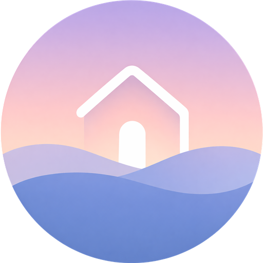
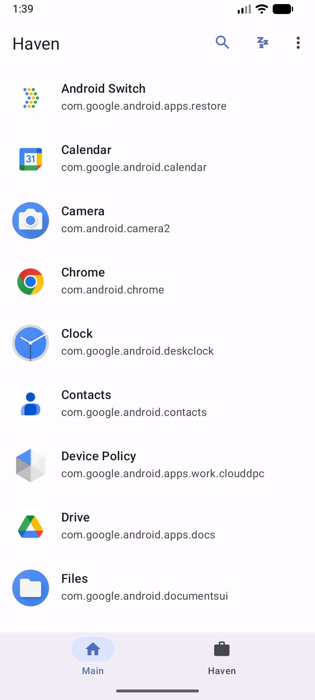
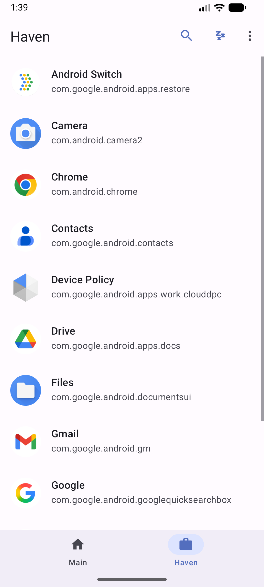
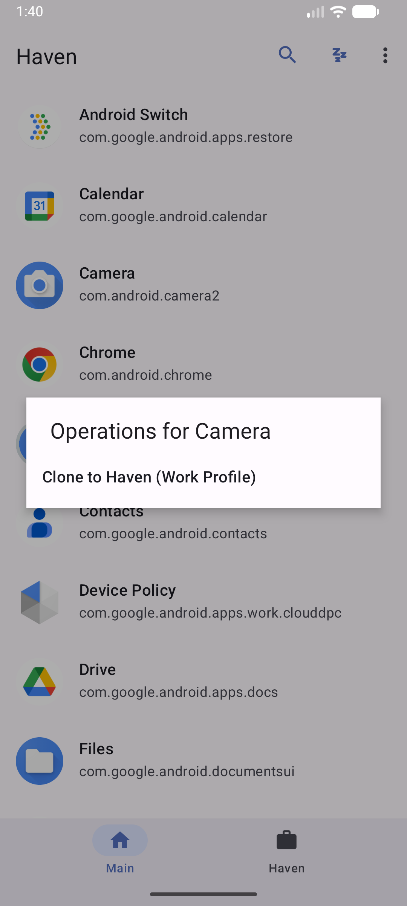

Haven
=====

[](https://github.com/Kenneth-Cho-InfoSec/Haven/actions/workflows/android-ci.yml)


<p align="center">
  
</p>

Haven is a Free and Open-Source Android Work Profile isolation app. It is a modernized fork in the Shelter / Island lineage, focused on maintaining the practical app-isolation workflow while bringing the codebase up to date with current Android security expectations, modern build tooling, and a Material Design 3 Expressive UI.

Haven lets you install, clone, freeze, and run apps inside a managed Work Profile so they stay separate from your main profile. This fork uses the application id `io.github.kennethchoinfosec.haven`, so it installs as a separate app and does not upgrade or replace existing installs of Shelter, Island, or other Work Profile managers.

Case Study
==========

**Problem:** Work Profile managers remain useful for Android privacy, but older Shelter / Island lineage code needs modern SDK targeting, dependency maintenance, and a cleaner user experience to remain credible on current devices.

**Approach:** Haven preserves the proven managed-profile workflow while refreshing the Android build stack, package identity, UI surfaces, and compatibility assumptions around newer platform behavior.

**Result:** The project demonstrates practical Android security maintenance: keeping a privacy tool auditable, installable beside its predecessors, and aligned with current Android expectations.

Screenshots
===========

<table>
  <tr>
    <td></td>
    <td></td>
    <td></td>
  </tr>
  <tr>
    <td align="center">Main profile</td>
    <td align="center">Work Profile</td>
    <td align="center">Clone flow</td>
  </tr>
</table>

Features
========

- Install apps inside a managed Work Profile for isolation
- Clone compatible apps between the main profile and the Work Profile
- Freeze apps inside the Work Profile to prevent background activity
- Create shortcuts for unfreezing, launching, and batch-freezing apps
- Shuttle files across profiles through Android's Documents UI
- Updated Android target SDK, Gradle/AGP stack, and dependency set
- Material Design 3 Expressive app theme, setup wizard, iconography, and navigation surfaces
- Modernized app identity and launcher icon for the Haven rebrand

Security and Maintenance
========================

Haven keeps the original Work Profile isolation model while applying modern security and compatibility maintenance:

- Current Android SDK targeting for newer platform behavior
- Updated dependency versions and build tooling
- Hardened manifest/package identity for the Haven fork
- Compatibility fixes for recent Android permission and provisioning flows
- Continued GPLv3 source availability for auditability

Architecture Snapshot
=====================

- Android Device Policy APIs own Work Profile provisioning and profile state.
- The app layer coordinates profile app listing, cloning, freezing, shortcuts, and cross-profile document handoff.
- The Haven package identity isolates this fork from existing Shelter or Island installs.

Status and Roadmap
==================

Current status: active modernization fork.

Near-term roadmap:

- Keep target SDK, AGP, and AndroidX dependencies current.
- Expand device compatibility notes for vendor-specific Work Profile behavior.
- Continue UI polish around setup, clone, freeze, and profile-management flows.

Build
=====

Requirements:

- JDK 17
- Android SDK Platform 36
- Android Build Tools 36.0.0 or newer

Build commands:

```
./gradlew assembleDebug
./gradlew lintDebug
./gradlew testDebugUnitTest
```

On Windows, use `gradlew.bat` instead of `./gradlew`.

Important Notes
===============

- Haven depends on Android's Work Profile and Device Policy APIs. Vendor ROMs that break or heavily customize Work Profiles may not work correctly.
- Because Haven uses a new application id, it will not inherit data, profile ownership, shortcuts, or permissions from another Work Profile manager.
- To uninstall Haven after provisioning, remove the Work Profile in Android Settings first, then uninstall the app normally.

Source and Issues
=================

- Source: https://github.com/Kenneth-Cho-InfoSec/Haven
- Issues: https://github.com/Kenneth-Cho-InfoSec/Haven/issues

License
=======

Haven remains licensed under the GNU General Public License v3.0. See `LICENSE`.
